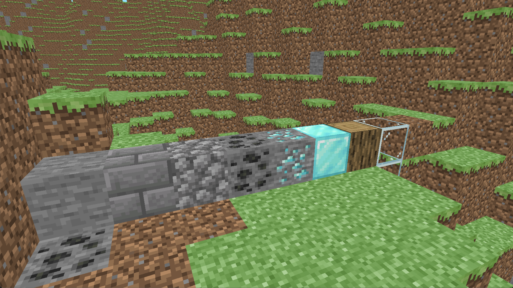

# Pycraft

A simple voxel engine written with Python + OpenGL

### Dependencies:
- moderngl
- pygame
- pyglm
- numpy
- pnoise2

### Features:
- Block placing and breaking
- Various blocks (wood, stone, glass, leaves, etc.)
- First person camera

### Screenshots:

